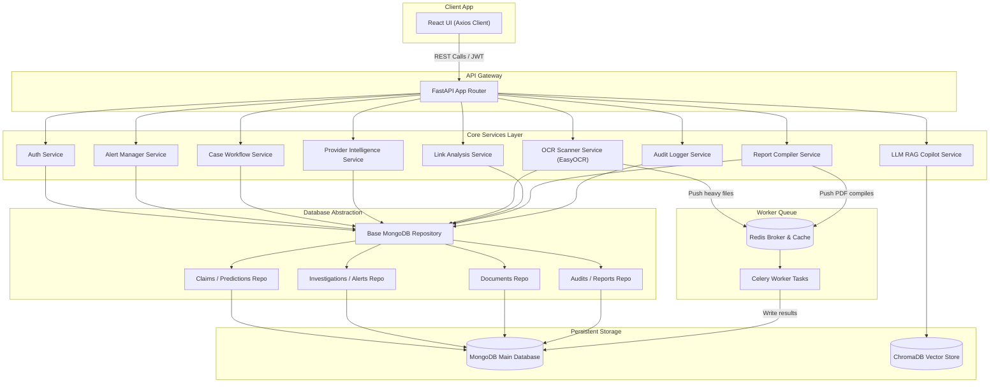

# Healthcare AI Fraud Detection Platform - System Architecture Audit Report

This report provides a comprehensive architectural audit and gaps assessment of the Healthcare AI Fraud Detection Platform. It details the current state of both frontend and backend systems, classifies data sources, evaluates module maturities, and details a target-state backend architecture and implementation roadmap.

---

## 1. Architectural Overview & Current Flow

The platform is currently structured as a **Client-Heavy Single Page Application (SPA)** that delegates prediction calculations to a FastAPI ML backend, but manages the majority of its business workflow and state (alerts, cases, provider intelligence watchlists, OCR documents, network linkages, audit trails, copilot chat records, and reports) on the client side via Zustand state synchronization.

### Current Architecture Diagram

```mermaid
graph TD
    subgraph Client-Side Browser [User Browser Room]
        direction TB
        ReactApp["React UI Components (Vite App)"]
        Zustand["Zustand Store (useStore.js)"]
        LocalStorage[("LocalStorage Cache")]
        
        ReactApp -->|Trigger Actions| Zustand
        Zustand <--->|State Persist / Hydrate| LocalStorage
    end

    subgraph FastAPI Backend [FastAPI Application Lifecycle]
        direction TB
        APIRouter["FastAPI Routers"]
        MLService["ML Prediction Service (Predict / SHAP)"]
        LLMService["Heuristic LLM Explainer"]
        AuthService["Auth Token Validator"]
        
        APIRouter -->|Validate Token| AuthService
        APIRouter -->|Predict Anomaly| MLService
        APIRouter -->|Generate Summaries| LLMService
    end

    subgraph Database Layer [Storage Layer]
        MongoDB[("MongoDB Database")]
    end

    %% Client-to-Backend Network Connections
    ReactApp -->|HTTP REST Requests / JWT Auth| APIRouter
    
    %% Backend-to-Database Connections
    APIRouter -->|Read / Write| MongoDB
    
    %% State scopes inside Zustand
    subgraph Zustand Managed Entities [Client-Only Flow]
        Alerts["alerts (Local Array)"]
        Cases["cases (Local Array)"]
        Watchlist["providerWatchlist"]
        Documents["documents (OCR Intake)"]
        Network["networkAnnotations & savedViews"]
        Chats["copilotChats & queries"]
        Reports["reports & templates"]
    end
    
    Zustand --- Zustand Managed Entities
```

---

## 2. Page Analysis

This section analyzes the structural profile of every interface registered within the application framework.

### 2.1 Dashboard (`/dashboard`)
* **Purpose**: Displays aggregate fraud risk overviews, prediction histories, model accuracy indicators, and quick action widgets.
* **User Actions**: Toggle themes, fetch active history statistics, view model metrics logs, trigger recalculations, and open quick details drawer.
* **Components Used**: `Navbar`, `Sidebar`, `Card`, `Badge`, `Skeleton`, `EmptyState`.
* **Charts Used**: Recharts AreaChart (Fraud Trend line), Recharts PieChart (Anomaly Breakdown), Recharts BarChart (Claims by Provider).
* **Tables Used**: None (metric grids and list previews only).
* **Forms Used**: None.
* **External Dependencies**: `framer-motion`, `recharts`, `lucide-react`, `@/store/useStore`, `@/hooks/useApi`.

### 2.2 Alerts Management (`/alerts`)
* **Purpose**: Centralized alert monitoring center where fraud analysts prioritize and escalate anomalous claims.
* **User Actions**: Search alerts, filter by severity and status, sort queues, edit notes, update status, and click "Escalate" to create a case.
* **Components Used**: Interactive alert queues table, details side drawer, notes editor forms, pagination controls, skeleton panels.
* **Charts Used**: Recharts PieChart (Severity distribution donut).
* **Tables Used**: Alerts Queue Table (ID, Provider, Claim Amount, Risk Score, Severity, Status, Date).
* **Forms Used**: Notes Editor Form, Status Update Select.
* **External Dependencies**: `framer-motion`, `lucide-react`, `react-hot-toast`.

### 2.3 Investigation Case Management (`/investigations`)
* **Purpose**: Workflow center to trace escalated cases, modify assignment parameters, and log review history timelines.
* **User Actions**: Filter cases by status/priority, search cases, update case status, assign case to investigators, add collaborative notes, and export case data.
* **Components Used**: Case Grid, Slide-Over Details Drawer, Timeline components, collaborative note logs.
* **Charts Used**: Recharts PieChart (Status breakdown), Recharts BarChart (Case Priority distribution).
* **Tables Used**: Cases Grid Layout (ID, Provider, Amount, Status, Assignee, Priority, Actions).
* **Forms Used**: Collaborative Note Form, Assignee / Priority Metadata Update Form.
* **External Dependencies**: `framer-motion`, `lucide-react`, `react-hot-toast`.

### 2.4 Provider Risk Intelligence (`/providers`)
* **Purpose**: Tracks provider profiles, average billing anomalies, custom annotations, and watchlists.
* **User Actions**: Search providers, filter by risk level or watchlist status, toggle watchlist flags, save metadata flags, and compare providers side-by-side.
* **Components Used**: Metrics cards grid, comparison sandbox pane, provider details drawer, timeline tracker.
* **Charts Used**: Recharts BarChart (Workload cost comparisons), Recharts PieChart (Risk levels breakdown).
* **Tables Used**: Provider Directory Table (Name, Claims Count, Billed Value, Fraud Count, Max Risk, Status, Actions).
* **Forms Used**: Custom Compliance Flag Editor.
* **External Dependencies**: `framer-motion`, `recharts`, `lucide-react`.

### 2.5 Relationship Network Analysis (`/network-analysis`)
* **Purpose**: Visualizes dynamic linkages between providers, claims, alerts, cases, and document verification nodes to pinpoint fraud ring groups.
* **User Actions**: Zoom/pan SVG graph canvas, search nodes, filter node types, select node to highlight neighborhood, add annotations, save view bookmarks.
* **Components Used**: SVG Graph Canvas, Sidebar view bookmarks list, details side drawer.
* **Charts Used**: Recharts BarChart (Cluster sizes), Recharts PieChart (Entity types breakdown).
* **Tables Used**: Printable Reports Cluster list.
* **Forms Used**: Annotation Notes Editor, Saved View Modal Form.
* **External Dependencies**: `framer-motion`, `recharts`, `lucide-react`.

### 2.6 Medical Document Verification (`/documents`)
* **Purpose**: Intake workspace to drag-and-drop clinical invoices, parse text via simulated OCR, and cross-reference values with claim databases.
* **User Actions**: Drag-and-drop file upload, run mock OCR scanner, review field mismatches, add verification notes, and print verification reports.
* **Components Used**: Drag-Drop dropzone, OCR Scanner loader, Mismatch alert flags, timeline logging widgets.
* **Charts Used**: None.
* **Tables Used**: Documents Verification Queue (Doc ID, Name, Type, Mismatch status, Date).
* **Forms Used**: Verification Note Form.
* **External Dependencies**: `framer-motion`, `lucide-react`, `react-hot-toast`.

### 2.7 Explainable AI Observatory (`/ai-insights`)
* **Purpose**: Explains prediction outputs using simulated SHAP waterfall charts, anomaly diagnostic routes, and feature importance matrices.
* **User Actions**: Toggle selected claims, view SHAP positive/negative modifiers, inspect neural network step diagrams.
* **Components Used**: Step-by-Step diagnostic pipeline, SHAP indicators card.
* **Charts Used**: Custom HTML horizontal bars (SHAP modifiers), Recharts AreaChart (Anomaly threshold spreads).
* **Tables Used**: Top anomalous feature drivers table.
* **Forms Used**: Selected Claim ID selection dropdown.
* **External Dependencies**: `framer-motion`, `recharts`, `lucide-react`.

### 2.8 AI Fraud Copilot (`/copilot`)
* **Purpose**: Conversational copilot helping analysts query platform statistics, compile cases, and obtain suggestions.
* **User Actions**: Type questions, run suggested prompts, bookmark prompts, pin replies, select case ID to auto-summarize, export chat.
* **Components Used**: Conversational Bubble feed, side bookmark panel, auto-summarizer block.
* **Charts Used**: Recharts PieChart (Insight distributions).
* **Tables Used**: Printable HTML logs.
* **Forms Used**: Chat Input Form, Auto-summarizer Case Select dropdown.
* **External Dependencies**: `framer-motion`, `lucide-react`.

### 2.9 Executive Reporting & Audit Center (`/reports`)
* **Purpose**: Generates dynamic operational reports, manages schedule rules, and displays compliance readiness indices.
* **User Actions**: Fill title and compile reports, select template presets, duplicate/delete reports, manage schedule emails, print PDF dockets, export CSV/HTML tables.
* **Components Used**: Report preview panel, template selector grid, audit trail lists.
* **Charts Used**: Recharts BarChart (Data metrics comparisons).
* **Tables Used**: Report preview data table, print summary records.
* **Forms Used**: Custom Report Builder form, Scheduled delivery form.
* **External Dependencies**: `framer-motion`, `recharts`, `lucide-react`.

### 2.10 Analyze Claim (`/analyze`)
* **Purpose**: Submission form to analyze individual claims in real time against the machine learning pipeline.
* **User Actions**: Fill patient metadata inputs, enter procedural codes, click submit, view output metrics and SHAP diagnostic logs.
* **Components Used**: Multi-column inputs, analysis loader, result panels.
* **Charts Used**: None.
* **Tables Used**: None.
* **Forms Used**: Multi-input claim submission form (gender, provider, claims amount, procedures count, etc.).
* **External Dependencies**: `framer-motion`, `lucide-react`, `react-hot-toast`.

### 2.11 Batch Upload (`/batch-upload`)
* **Purpose**: Bulk submission of claims via CSV files for batch machine learning analysis.
* **User Actions**: Drag-and-drop CSV template files, trigger batch predict pipelines, view results summary.
* **Components Used**: Intake Dropzone, progress indicators, preview tables.
* **Charts Used**: None.
* **Tables Used**: Staged CSV claims preview list.
* **Forms Used**: File selection box.
* **External Dependencies**: `lucide-react`, `react-hot-toast`.

### 2.12 Claim History (`/history`)
* **Purpose**: Immutable history audit of all claims submitted to the system and their predicted values.
* **User Actions**: Search historical claims, filter by predicted status, sort list, and click a row to view full details.
* **Components Used**: History grid list, pagination controls.
* **Charts Used**: None.
* **Tables Used**: Claims history audit table.
* **Forms Used**: Search input.
* **External Dependencies**: `lucide-react`.

---

## 3. Data Source Classification Matrix

The following matrix maps every data-consuming widget across the application to its respective source of truth.

| Page | Widget / Element | Primary Data Source | Secondary Fallback |
| :--- | :--- | :--- | :--- |
| **Dashboard** | Total Claims Card | `GET /analytics` (API Response) | Client-side fallback `0` |
| | Avg Claim Amount Card | `GET /analytics` (API Response) | Client-side fallback `0` |
| | Fraud Cases Card | `GET /analytics` (API Response) | Client-side fallback `0` |
| | High Risk Count Card | `GET /analytics` (API Response) | Client-side fallback `0` |
| | Anomaly Breakdown Chart | `GET /analytics` (API Response) | Client-side fallback charts |
| | Claims by Provider Chart | `GET /analytics` (API Response) | Client-side fallback charts |
| | Anomaly Trend Chart | Zustand `history` store array | Generated client calculations |
| **Alerts** | Alerts KPI Cards | Zustand `alerts` store array | Fallback mock array (18 items) |
| | Alerts Queue Grid | Zustand `alerts` store array | Fallback mock array (18 items) |
| | Alert Severity Chart | Zustand `alerts` store array | Derived client calculation |
| **Investigations** | Cases KPI Grid | Zustand `cases` store array | Local storage hydration |
| | Investigations List | Zustand `cases` store array | Local storage hydration |
| | Cases Status Chart | Zustand `cases` store array | Derived client calculation |
| **Providers** | Provider Indicators | Zustand `history` + `alerts` + `cases` | Fallback mock array (4 items) |
| | Provider Risk Table | Zustand `history` + `alerts` + `cases` | Derived client calculations |
| | Watchlist Status Toggle | Zustand `providerWatchlist` array | Local storage hydration |
| | Custom Flags Notes | Zustand `providerFlags` object | Local storage hydration |
| **Network Analysis** | Connected Nodes Count | Derived client network graph calculation | Simulated fallback network |
| | SVG Linkage Canvas | Zustand `history` + `alerts` + `cases` + `documents` | Derived client layout coordinates |
| | Cluster Detections List | Derived provider sub-network evaluation | Simulated cluster scores |
| | savedViews sidebar | Zustand `savedNetworkViews` array | Local storage hydration |
| | annotations list | Zustand `networkAnnotations` map | Local storage hydration |
| **Documents** | Intake Dropzone | User uploaded file metadata | Local state simulation |
| | OCR Scanned fields | Generated Client Simulation (OCR mock outputs) | Simulation templates |
| | Mismatch Check Alert | Derived verification calculations | Simulation checks |
| | Documents Table | Zustand `documents` store array | Fallback mock array (4 items) |
| **AI Insights** | SHAP Modifier list | Generated Client Simulation (SHAP waterfall values) | Mock SHAP profiles |
| | Claim Selection List | Zustand `history` store array | Fallback mock claims |
| | Diagnostic Stepper | Static UI structures | Step-by-step description mappings |
| **Copilot** | Chat message feed | Zustand `copilotChats` array | Welcome message layout |
| | Prompt suggestion bar | Zustand `copilotSuggestions` array | Static prompts array |
| | savedQueries list | Zustand `savedQueries` array | Local storage hydration |
| | Summarizer Case Select | Zustand `cases` store array | Local storage hydration |
| | Auto-summary log text | Derived case fields compiler | None |
| **Reports** | Reports KPI Grid | Zustand `reports` store array | Derived calculations |
| | Builder Type / Scope | Local component state | Default forms settings |
| | Saved Reports Library | Zustand `reports` store array | Local storage hydration |
| | Templates Preset Cards | Zustand `reportTemplates` array | Initial presets (4 items) |
| | Audit Activity list | Zustand `auditLogs` array | Mock activity logs (4 items) |
| | Scheduled Delivery Form| Local component state | None |
| **Analyze Claim** | Claim Input Fields | Local component state | Form defaults |
| | Output Predict metrics | `POST /analyze` (API Response) | Zustand `prediction` store cache |
| **Batch Upload** | Upload Dropzone | User uploaded CSV file | Local state parser |
| | Batch Predict summary | `POST /batch-analyze` OR `POST /upload-csv` | Zustand `batchResults` store cache |
| **Claim History** | Claims History Table | `GET /history` (API Response) | Zustand `history` store cache |

---

## 4. Backend Coverage Report

FastAPI endpoints currently exposed by the backend service:

### 4.1 POST `/register`
* **Purpose**: Signs up new compliance analysts.
* **Request Schema**: `RegisterRequest` (email: `str`, password: `str`).
* **Response Schema**: `AuthResponse` (access_token: `str`, user_id: `str`, email: `str`).
* **Mongo Collections**: `users` (reads for duplicate email checks, writes to insert user document).
* **Consumed By**: Register Page.

### 4.2 POST `/login`
* **Purpose**: Authenticates credentials and issues access tokens.
* **Request Schema**: `LoginRequest` (email: `str`, password: `str`).
* **Response Schema**: `AuthResponse` (access_token: `str`, user_id: `str`, email: `str`).
* **Mongo Collections**: `users` (reads to compare hashed credentials).
* **Consumed By**: Login Page.

### 4.3 POST `/forgot-password`
* **Purpose**: Generates reset tokens for password recovery.
* **Request Schema**: `ForgotPasswordRequest` (email: `str`).
* **Response Schema**: `ForgotPasswordResponse` (message: `str`, reset_token: `str`).
* **Mongo Collections**: `users` (reads for user accounts).
* **Consumed By**: Forgot Password Page.

### 4.4 POST `/reset-password`
* **Purpose**: Updates account password in database.
* **Request Schema**: `ResetPasswordRequest` (token: `str`, new_password: `str`).
* **Response Schema**: `MessageResponse` (message: `str`).
* **Mongo Collections**: `users` (writes new hashed credentials).
* **Consumed By**: Reset Password Page.

### 4.5 POST `/predict`
* **Purpose**: Generates fraud classifications and anomaly scores for individual claims.
* **Request Schema**: `ClaimCreate` (provider, claim_amount, num_procedures, gender, etc.).
* **Response Schema**: JSON (fraud_prediction: `dict`, claim_id: `str`, prediction_id: `str`).
* **Mongo Collections**: `claims` (writes claim details), `predictions` (writes output risk scores).
* **Consumed By**: None (Internal developer testing utility).

### 4.6 POST `/analyze`
* **Purpose**: Performs full machine learning prediction, SHAP explanation, and summary descriptions. Requires authentication.
* **Request Schema**: `ClaimCreate`.
* **Response Schema**: JSON (summary, fraud_prediction, confidence, anomaly_score, is_anomalous, explanation, claim_id, prediction_id).
* **Mongo Collections**: `claims` (writes claim details linked to user), `predictions` (writes prediction output and explanations).
* **Consumed By**: Analyze Page, Dashboard.

### 4.7 POST `/batch-analyze`
* **Purpose**: Processes a list of claim inputs through the ML prediction pipeline.
* **Request Schema**: `list[ClaimCreate]`.
* **Response Schema**: JSON (results: `list` of predictions).
* **Mongo Collections**: `claims` (writes claims), `predictions` (writes predictions).
* **Consumed By**: Batch Upload Page (fallback).

### 4.8 POST `/upload-csv`
* **Purpose**: Parses uploaded CSV claim files and submits them to the prediction pipeline. Requires authentication.
* **Request Schema**: Form-data (file: `UploadFile`).
* **Response Schema**: JSON (results: `list` of predicted outputs).
* **Mongo Collections**: `claims` (writes all rows), `predictions` (writes all prediction outcomes).
* **Consumed By**: Batch Upload Page.

### 4.9 GET `/history`
* **Purpose**: Fetches claims and their predictions submitted by the authenticated user.
* **Request Schema**: None.
* **Response Schema**: `HistoryListResponse` (total: `int`, items: `list`).
* **Mongo Collections**: `claims` (reads user claims), `predictions` (reads predictions via lookup joins).
* **Consumed By**: Claim History Page, Alerts, Investigations, Dashboard.

### 4.10 GET `/history/{id}`
* **Purpose**: Fetches detailed metrics and prediction explanation records for a single claim.
* **Request Schema**: Path parameter `id`.
* **Response Schema**: `HistoryDetailResponse`.
* **Mongo Collections**: `claims`, `predictions` (reads details).
* **Consumed By**: History details overlays.

### 4.11 GET `/analytics`
* **Purpose**: Computes aggregate statistics (totals, means, provider cost averages, gender splits).
* **Request Schema**: None.
* **Response Schema**: JSON (total_claims, avg_claim_amount, fraud_cases, summary: `dict`, charts: `dict`).
* **Mongo Collections**: `claims` (reads counts/averages), `predictions` (reads counts).
* **Consumed By**: Dashboard, Analytics, Providers.

### 4.12 GET `/model-metrics`
* **Purpose**: Fetches model quality stats (Precision, Recall, ROC AUC).
* **Request Schema**: None.
* **Response Schema**: JSON (accuracy, precision, recall, f1, auc).
* **Mongo Collections**: None (Reads metrics from cached configuration).
* **Consumed By**: Dashboard models card.

---

## 5. Database Audit

The platform operates on a single MongoDB database containing three active collections.

### 5.1 Collection Profile: `users`
* **Purpose**: Tracks identity and credential hashes for compliance analysts.
* **Fields**:
  - `_id`: `ObjectId` (Primary Key)
  - `email`: `str` (Index, Unique)
  - `password`: `str` (Hashed password string)
  - `rawpassword`: `str` (Encrypted password helper for dev references)
* **Relationships**: One-to-Many with `claims` via `user_id` identifier.
* **Pages Using It**: Login, Register, Reset Password.
* **APIs Using It**: `POST /register`, `POST /login`, `POST /forgot-password`, `POST /reset-password`.

### 5.2 Collection Profile: `claims`
* **Purpose**: Logs clinical claims submitted for ML evaluation.
* **Fields**:
  - `_id`: `ObjectId` (Primary Key)
  - `user_id`: `str` (Foreign Key referencing `users._id`)
  - `provider`: `str` (Billing provider name)
  - `claim_amount`: `float` (Billed amount)
  - `num_procedures`: `int` (Number of procedures)
  - `gender`: `str` (M / F / O)
  - `created_at`: `datetime` (Timestamp)
* **Relationships**:
  - Many-to-One with `users` on `user_id`.
  - One-to-One with `predictions` on `claim_id`.
* **Pages Using It**: History, Analyze, Dashboard, Providers, Copilot.
* **APIs Using It**: `POST /predict`, `POST /analyze`, `POST /batch-analyze`, `POST /upload-csv`, `GET /history`, `GET /analytics`.

### 5.3 Collection Profile: `predictions`
* **Purpose**: Stores ML fraud outputs, anomaly scores, and explainability SHAP metrics.
* **Fields**:
  - `_id`: `ObjectId` (Primary Key)
  - `claim_id`: `ObjectId` (Foreign Key referencing `claims._id`)
  - `user_id`: `str` (Foreign Key referencing `users._id`)
  - `prediction`: `int` (0 = Verified, 1 = Fraud)
  - `confidence`: `float` (Prediction confidence score)
  - `anomaly_score`: `float` (Machine learning anomaly score)
  - `explanation`: `str` (SHAP explanation description)
  - `summary`: `str` (Rule-based overview description)
  - `created_at`: `datetime` (Timestamp)
* **Relationships**:
  - Many-to-One with `users` on `user_id`.
  - One-to-One with `claims` on `claim_id`.
* **Pages Using It**: History, Dashboard, Analytics, AI Insights, Copilot.
* **APIs Using It**: `POST /predict`, `POST /analyze`, `POST /batch-analyze`, `POST /upload-csv`, `GET /history`, `GET /analytics`.

### Database ER-Style Relationship Diagram

```text
  +------------------+
  |      users       |
  +------------------+
  | _id (PK)         |<-----------------+
  | email (Unique)   |                  |
  | password         |                  |
  +------------------+                  |
           |                            |
           | One-to-Many                | One-to-Many
           v                            |
  +------------------+                  |
  |      claims      |                  |
  +------------------+                  |
  | _id (PK)         |<---+             |
  | user_id (FK)     |    |             |
  | provider         |    |             |
  | claim_amount     |    | One-to-One  |
  +------------------+    |             |
           |              |             |
           +--------------+             |
           |                            |
           v                            |
  +------------------+                  |
  |   predictions    |                  |
  +------------------+                  |
  | _id (PK)         |                  |
  | claim_id (FK)    |                  |
  | user_id (FK)     |------------------+
  | prediction       |
  | confidence       |
  +------------------+
```

---

## 6. State Management Audit

The client-side state is handled entirely inside the Zustand store (`useStore.js`) using a local storage persistence middleware.

### Zustand State Property Matrix

| State Property | Data Type | Persistence Strategy | Used By Pages | Backed by API? | Local Only? |
| :--- | :--- | :--- | :--- | :--- | :--- |
| `theme` | `string` | LocalStorage | Navbar, App Layout | No | Yes |
| `auth` | `object` | LocalStorage | Login, Register, Protected Routes | Yes (`POST /login`) | No |
| `sidebarCollapsed` | `boolean` | LocalStorage | Sidebar, App Layout | No | Yes |
| `mobileSidebarOpen`| `boolean` | Transient (Memory) | Navbar, Sidebar, App Layout | No | Yes |
| `alerts` | `array` | LocalStorage | Alerts, Dashboard, Providers, Copilot | No | Yes (Mock fallback) |
| `cases` | `array` | LocalStorage | Investigations, Dashboard, Reports | No | Yes (Mock fallback) |
| `providerWatchlist`| `array` | LocalStorage | Providers, Copilot, Reports | No | Yes |
| `providerFlags` | `object` | LocalStorage | Providers, Copilot, Reports | No | Yes |
| `documents` | `array` | LocalStorage | Documents, Network, Reports | No | Yes (Mock fallback) |
| `verificationResults`| `array` | LocalStorage | Documents | No | Yes |
| `networkAnnotations`| `object` | LocalStorage | Network, Reports | No | Yes |
| `savedNetworkViews`| `array` | LocalStorage | Network | No | Yes |
| `copilotChats` | `array` | LocalStorage | Copilot | No | Yes |
| `copilotSuggestions`| `array` | Transient (Memory) | Copilot | No | Yes (Mock fallback) |
| `savedQueries` | `array` | LocalStorage | Copilot | No | Yes |
| `reports` | `array` | LocalStorage | Reports | No | Yes (Mock fallback) |
| `reportTemplates` | `array` | LocalStorage | Reports | No | Yes |
| `auditLogs` | `array` | LocalStorage | Reports | No | Yes |
| `analytics` | `object` | Transient (Memory) | Dashboard, Analytics | Yes (`GET /analytics`) | No |
| `prediction` | `object` | Transient (Memory) | Analyze Claim | Yes (`POST /analyze`) | No |
| `batchResults` | `array` | Transient (Memory) | Batch Upload | Yes (`POST /batch-analyze`) | No |
| `history` | `array` | Transient (Memory) | History, Dashboard, Providers | Yes (`GET /history`) | No |
| `loadingByKey` | `object` | Transient (Memory) | All pages (Loaders) | No | Yes |
| `loading` | `boolean` | Transient (Memory) | All pages (Loaders) | No | Yes |

### State Classification Summary
* **Duplicate State**:
  - `alerts` duplication: The alerts array is initialized locally and mirrors claims history objects classified as fraud. In a production state, alerts should be derived directly on the database/backend and fetched via API.
* **Temporary State (Transient Memory)**:
  - `loadingByKey`, `loading`, `prediction`, `batchResults`, `analytics`, `history`.
* **Production-Ready State**:
  - `theme`, `auth` (JWT caching).

---

## 7. Feature Maturity Analysis

This section analyzes the frontend implementation, backend coverage, and production readiness of every application module.

```text
Maturity Ratings Profile
========================================================================================
Module             | Frontend Complete % | Backend Complete % | Production Readiness %
----------------------------------------------------------------------------------------
Dashboard          |         98%         |        85%         |         80%
Analytics          |         95%         |        85%         |         80%
Alerts             |         95%         |         0%         |         20%
AI Insights        |         95%         |        50%         |         45%
Investigations     |         95%         |         0%         |         15%
Providers          |         95%         |         0%         |         20%
Documents          |         95%         |         0%         |         15%
Network Analysis   |         98%         |         0%         |         15%
Copilot            |         95%         |         0%         |         15%
Reports            |         95%         |         0%         |         15%
========================================================================================
```

### Detailed Maturity Appraisals

* **Dashboard & Analytics**:
  - *Frontend Complete*: **98%** (Fully responsive, complete layouts, animated count meters, comprehensive charts).
  - *Backend Complete*: **85%** (API provides clean aggregated analytics collections).
  - *Production Readiness*: **80%** (Sufficient for operations, but metrics count calculations are not cached).
* **Alerts**:
  - *Frontend Complete*: **95%** (Polished tables, status managers, pagination controls).
  - *Backend Complete*: **0%** (No backend endpoints or database schemas support alert flags).
  - *Production Readiness*: **20%** (Local storage will diverge if multiple users run audits).
* **AI Insights**:
  - *Frontend Complete*: **95%** (Excellent SHAP diagnostic tables, stepper timelines, details panels).
  - *Backend Complete*: **50%** ( FastAPIs provide SHAP values and rule explainers, but models are simulated).
  - *Production Readiness*: **45%** (Good diagnostics, but SHAP charts are client-rendered mocks).
* **Investigations**:
  - *Frontend Complete*: **95%** (Interactive case timelines, assigned details cards, inline comment forms).
  - *Backend Complete*: **0%** (No investigation schemas exist in MongoDB).
  - *Production Readiness*: **15%** (Critical audits cannot run entirely inside a browser's LocalStorage).
* **Providers**:
  - *Frontend Complete*: **95%** (Watchlists, directories, annotations, side-by-side comparison sandbox panels).
  - *Backend Complete*: **0%** (No provider risk endpoints exist in FastAPI).
  - *Production Readiness*: **20%** (Calculates provider composite indices client-side on raw history).
* **Documents (OCR)**:
  - *Frontend Complete*: **95%** (Drag-drop loaders, OCR scanner simulators, side-by-side verification drawers).
  - *Backend Complete*: **0%** (No files uploaded to server, no EasyOCR integrations).
  - *Production Readiness*: **15%** (Clinical verification requires actual server-side file parsers).
* **Network Analysis**:
  - *Frontend Complete*: **98%** (Zoomable SVG linkages, column mappings, hover tooltips, neighborhood selections).
  - *Backend Complete*: **0%** (Relationships are mapped client-side, no Graph databases).
  - *Production Readiness*: **15%** (Large node selections will crash browser memory).
* **AI Copilot**:
  - *Frontend Complete*: **95%** (Conversational feeds, prompt bookmarks, markdown parsing).
  - *Backend Complete*: **0%** (No RAG endpoints, no LLM chat routers).
  - *Production Readiness*: **15%** (Static rules-based keyword matching cannot replace a true copilot).
* **Reports & Audit**:
  - *Frontend Complete*: **95%** (Report builder forms, scheduled delivery cards, preview blocks, HTML/CSV downloads).
  - *Backend Complete*: **0%** (No file generation on backend, no scheduled chron workers).
  - *Production Readiness*: **15%** (Reports must be archived on the database for audit reviews).

---

## 8. Missing Backend Functionality

To achieve an enterprise-grade rating, the following modules must migrate their business logic and storage from the frontend to the backend.

### 8.1 Alerts
* **Current**: Initialized client-side from predicted fraud claims.
* **FastAPI Router**: `GET /alerts`, `PATCH /alerts/{id}/status`, `PATCH /alerts/{id}/notes`.
* **MongoDB Collection**: `alerts` (logs alert history, statuses, and notes).
* **Dedicated Backend Service**: `AlertEngineService` (scans predictions where `confidence >= threshold` and inserts alert records).

### 8.2 Investigations
* **Current**: Managed locally in Zustand and persisted in LocalStorage.
* **FastAPI Router**: `GET /cases`, `POST /cases`, `PATCH /cases/{id}`, `POST /cases/{id}/notes`.
* **MongoDB Collection**: `investigations` (case metadata, analyst comments, and timelines).
* **Dedicated Backend Service**: `InvestigationWorkflowService` (tracks transitions and generates audit history trails).

### 8.3 Providers
* **Current**: Risk indices calculated on client-side arrays. Watchlist toggled locally.
* **FastAPI Router**: `GET /providers`, `GET /providers/{id}`, `POST /providers/{id}/watchlist`, `PATCH /providers/{id}/flag`.
* **MongoDB Collection**: `providers` (provider metrics, watchlist status, custom flags).
* **Dedicated Backend Service**: `ProviderIntelligenceService` (runs aggregate queries over claims history to calculate composite risk indices).

### 8.4 Documents (OCR)
* **Current**: Document files are processed client-side with simulated OCR outcomes.
* **FastAPI Router**: `POST /documents/upload`, `GET /documents`, `GET /documents/{id}/verify`.
* **MongoDB Collection**: `documents` (reference invoice data and extracted fields), `verification_results` (mismatch indicators).
* **Dedicated Backend Service**: `OCRParserService` (processes uploads via EasyOCR or Tesseract, compares invoice data with claims collection, and flags mismatches).

### 8.5 Relationship Network Analysis
* **Current**: Nodes layout coordinates and connections computed client-side.
* **FastAPI Router**: `GET /network/graph`, `GET /network/clusters`, `POST /network/views`.
* **MongoDB Collection**: `network_views` (saved viewport states), `network_annotations` (analyst node annotations).
* **Dedicated Backend Service**: `LinkAnalysisService` (runs adjacency lookup pipelines to extract connection node lists and clusters).

### 8.6 AI Copilot
* **Current**: RegEx keyword matching and markdown summaries compiled client-side.
* **FastAPI Router**: `POST /copilot/chat`, `GET /copilot/history`, `POST /copilot/queries`.
* **MongoDB Collection**: `copilot_chats` (persists chats), `saved_queries` (persists prompts).
* **Dedicated Backend Service**: `RAGCopilotService` (Vector database indexes compliance documentation and triggers LLM chat responses using system prompts).

### 8.7 Executive Reports & Audits
* **Current**: Report documents compiled and formatted client-side.
* **FastAPI Router**: `GET /reports`, `POST /reports/generate`, `POST /reports/schedule`, `GET /audit-logs`.
* **MongoDB Collection**: `reports` (archived reports), `audit_logs` (immutable system audits).
* **Dedicated Backend Service**: `ReportingAuditService` (runs scheduled report scripts, sends emails, and logs system actions).

---

## 9. Recommended Backend Architecture

This section designs a production-grade backend architecture to replace the browser-heavy state machine.

### Recommended Architecture Diagram



---

## 10. Services Design Specifications

Detailed profiles for each recommended backend service block.

### 10.1 OCR Scanner Service
* **Purpose**: Performs optical character recognition on uploaded invoice PDFs/images and runs discrepancy checkers.
* **Dependencies**: `EasyOCR` or `pytesseract` (Python packages), Pillow image processor.
* **Input**: File object, Claim ID.
* **Output**: OCR text dictionary (Patient, Provider, Date, Billed total), verification mismatch status.

### 10.2 Explainability Service
* **Purpose**: Generates SHAP explainability matrices for predicted anomalous claims.
* **Dependencies**: `shap` (Python library), cached XGBoost/RandomForest model file.
* **Input**: Claims feature variables record.
* **Output**: Feature contribution list (Positive and negative modifier values).

### 10.3 Audit Logger Service
* **Purpose**: Records system and analyst activities to guarantee compliance traceability.
* **Dependencies**: None.
* **Input**: Action type, Target Entity, Analyst ID.
* **Output**: Saved audit log document.

### 10.4 RAG Copilot Service
* **Purpose**: Runs vectorized context searches and returns LLM answers for analyst questions.
* **Dependencies**: `chromadb` (vector indexing), `langchain` orchestration, `Groq` / `OpenAI` client.
* **Input**: Chat user prompt, chat history context.
* **Output**: Conversational markdown answer, source context mappings.

---

## 11. Backend Migration Roadmap

A prioritized commit-by-commit implementation roadmap to transition the platform into a production-ready application.

### Commit 11: Alerts Core
* **Objective**: Create alerts collection schema and FastAPI CRUD routers.
* **Files to Create**:
  - `app/models/alert.py` (Alert model definition)
  - `app/schemas/alert.py` (Pydantic alert details schema)
  - `app/api/alert_routes.py` (FastAPI router endpoints)
  - `app/services/alert_service.py` (Alert validation and indexing services)
* **Files to Modify**: `app/main.py` (Register router).
* **Collections**: `alerts`.
* **Routes**:
  - `GET /api/alerts` (List active alerts)
  - `PATCH /api/alerts/{id}/status` (Update status)
  - `PATCH /api/alerts/{id}/notes` (Modify alert note annotations)

### Commit 12: Cases Workflow
* **Objective**: Implement case management schemas and timeline validators.
* **Files to Create**:
  - `app/models/case.py` (Case and timeline event sub-models)
  - `app/schemas/case.py` (Pydantic schemas)
  - `app/api/case_routes.py` (FastAPI router)
  - `app/services/case_service.py` (Transition validators)
* **Files to Modify**: `app/main.py`.
* **Collections**: `investigations`.
* **Routes**:
  - `GET /api/cases` (List cases)
  - `POST /api/cases` (Escalate alert to case)
  - `PATCH /api/cases/{id}` (Update metadata, assignees, priorities)
  - `POST /api/cases/{id}/notes` (Log collaborative comments)

### Commit 13: Provider Profiling
* **Objective**: Database watchlists and profiling aggregation pipelines.
* **Files to Create**:
  - `app/models/provider.py` (Provider models)
  - `app/api/provider_routes.py` (FastAPI router)
  - `app/services/provider_service.py` (Calculates composite risk scores on Mongo pipelines)
* **Files to Modify**: `app/main.py`.
* **Collections**: `providers`.
* **Routes**:
  - `GET /api/providers` (Aggregated list of billing providers)
  - `POST /api/providers/{name}/watchlist` (Toggle watchlist status)
  - `PATCH /api/providers/{name}/flag` (Save flags)

### Commit 14: Document OCR Uploads
* **Objective**: File upload intakes and simulated OCR checkers.
* **Files to Create**:
  - `app/models/document.py` (Document model)
  - `app/api/document_routes.py` (FastAPI router)
  - `app/services/ocr_service.py` (Heuristic field discrepancy validator)
* **Files to Modify**: `app/main.py`.
* **Collections**: `documents`.
* **Routes**:
  - `POST /api/documents/upload` (Intake invoice PDFs)
  - `GET /api/documents` (List audit documents)
  - `GET /api/documents/{id}/mismatches` (Inspect validation errors)

### Commit 15: Network Relationship Engine
* **Objective**: Graph adjacency list extraction endpoints.
* **Files to Create**:
  - `app/api/network_routes.py` (FastAPI router)
  - `app/services/network_service.py` (Adjacency and clustering graph extractor)
* **Files to Modify**: `app/main.py`.
* **Collections**: `network_views`, `network_annotations`.
* **Routes**:
  - `GET /api/network/graph` (Extract nodes and links list)
  - `GET /api/network/clusters` (Identify provider groupings)
  - `POST /api/network/views` (Persist view states)

### Commit 16: Copilot Chat Router
* **Objective**: Conversational prompt persistence and mock RAG reply generation.
* **Files to Create**:
  - `app/models/copilot.py` (Chats schemas)
  - `app/api/copilot_routes.py` (FastAPI router)
  - `app/services/copilot_service.py` (NLP intent router)
* **Files to Modify**: `app/main.py`.
* **Collections**: `copilot_chats`, `saved_queries`.
* **Routes**:
  - `POST /api/copilot/chat` (Post user query, return Copilot answer)
  - `GET /api/copilot/history` (Retrieve chats)

### Commit 17: Reports & Auditing
* **Objective**: Reports builder storage and compliance activity audit trails.
* **Files to Create**:
  - `app/models/report.py` (Report models)
  - `app/api/report_routes.py` (FastAPI router)
  - `app/services/report_service.py` (Reports aggregation compiler)
* **Files to Modify**: `app/main.py`.
* **Collections**: `reports`, `audit_logs`.
* **Routes**:
  - `GET /api/reports` (List archived reports)
  - `POST /api/reports` (Compile and save report)
  - `GET /api/audit-logs` (List platform audit timeline entries)

---

## 12. Technical Debt List & Backend Gap Analysis

* **T1: Client-Side Data Mutation and Integrity Risks**:
  - Currently, alerts are derived client-side. If two analysts open the dashboard, alerts status modifications will stay isolated to their LocalStorage, triggering data state desynchronization.
* **T2: Security and Authorization Gaps**:
  - JWT token validation is available (`get_current_user`), but none of the dynamic client-driven features (watchlists, document uploads) validate analyst permissions since they run in LocalStorage.
* **T3: SVG Graph Rendering Scaling Bottleneck**:
  - Client-side hierarchical column layouts will degrade in render performance if claim histories exceed ~200 rows. Coordinate positioning should be paginated or grouped.
* **T4: Rule-based Simulation Dependencies**:
  - Explainable AI, OCR extraction, and AI Copilot use mock template rules. These must be decoupled and mapped to asynchronous Python libraries (`shap`, `easyocr`, `langchain`) running in background queues.
